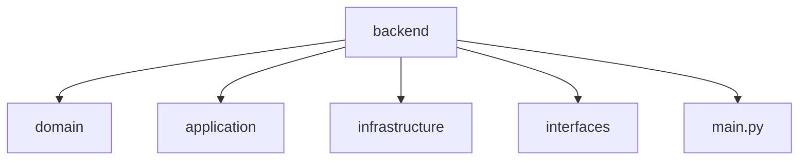

**Language:** 🇺🇸 English | [🇧🇷 Português](./README.pt-br.md)


# Central de Chamados – Backend

### Serverless Multi-Tenant Backend for Structured WhatsApp-Based Service Operations

---

## 1. Overview

This repository contains the core backend service of the **Central de Chamados** platform.

It is responsible for transforming unstructured WhatsApp-driven interactions into a structured, traceable, multi-tenant operational workflow.

This backend is:

- Domain-oriented
- Serverless
- Multi-tenant
- Production-ready by design
- AI-ready for future cognitive automation

The system is not a tutorial project.

It is a real-world architecture exercise designed to solve operational inefficiencies in small service businesses.

---

## 2. Problem Being Solved

Small service operations rely heavily on WhatsApp for:

- Quotes
- Service approvals
- Status updates
- Customer complaints
- Post-sale communication

However, WhatsApp provides communication — not operational structure.

The result is:

- Forgotten service requests
- Implicit status control
- Lack of structured history
- Owner-dependent memory
- Limited scalability

This backend introduces:

> Formal structure over informal communication.

---

## 3. Architectural Model

### High-Level Characteristics

- SaaS
- Multi-tenant
- Serverless
- API-first
- Horizontally scalable
- Domain-driven structure

### Core Stack

- AWS Lambda
- API Gateway
- DynamoDB (Single Table Design)
- JWT-based authentication
- Terraform (infra managed separately)

---

## 4. Domain Design

The system is modeled around real operational queries, not theoretical normalization.

### Core Entities

- Company (Tenant)
- User
- Customer
- Device
- Service Ticket
- Ticket History
- Service Configuration

### Design Principles

- History as a first-class entity
- Explicit status transitions
- Tenant isolation via `company_id`
- Access pattern–driven modeling
- Idempotent critical operations

---

## 5. Multi-Tenancy Strategy

Each record includes `company_id` as part of its primary key structure.

Isolation strategy:

- Logical isolation at database level
- Authorization context bound to JWT
- Query patterns scoped by tenant
- No cross-tenant aggregation

This allows horizontal scale without database duplication.

---

## 6. DynamoDB & Single Table Design

The system uses a Single Table Design optimized for:

- Predictable query performance
- Reduced join-like operations
- Efficient hierarchical retrieval
- Ticket + History access patterns

### Why DynamoDB?

- Low latency
- Native horizontal scaling
- Pay-per-use model
- Operational simplicity in serverless

### Trade-offs

- Higher modeling complexity
- Requires strict key design discipline
- Query-driven schema instead of relational flexibility

---

## 7. API Design

The API is:

- RESTful
- Versioned
- Stateless
- JWT-protected

### Key Principles

- Idempotency for write operations
- Explicit error contracts
- Tenant-aware routing
- Clear separation between domain and delivery layer

---

## 8. Production Considerations

Designed from day one with production in mind:

- Serverless auto-scaling
- Cold start mitigation strategy
- Structured logging
- Metrics-ready architecture
- Explicit error boundaries
- API versioning
- Secure environment separation

---

## 9. Observability Strategy (Planned / Expandable)

- Structured JSON logs
- Request correlation IDs
- Tenant-based metrics
- Error classification
- Latency tracking

Prepared for integration with monitoring stack.

---

## 10. AI-Ready Design

The architecture allows future integration of:

- Message intent classification
- Automatic summarization of ticket history
- Response suggestion engine
- Risk detection for delayed tickets
- Operational pattern analysis

The domain core does not require restructuring to support these features.

---

## 11. Project Structure




### Layer Responsibilities

- `domain/` → Core business rules
- `application/` → Use cases orchestration
- `infrastructure/` → DynamoDB, external services
- `interfaces/` → API layer / handlers

Architecture inspired by Clean Architecture principles.

---

## 12. Running Locally

(Adjust based on your setup)

```bash
# Install dependencies
pip install -r requirements.txt

# Run locally
uvicorn main:app --reload
```

## 13. Deployment

Deployment is managed via Terraform in the dedicated infrastructure repository.

This backend is packaged and deployed to AWS Lambda using a serverless architecture.

Deployment characteristics:

- Infrastructure as Code (Terraform)
- Environment separation (dev / staging / prod)
- Versioned API Gateway configuration
- IAM roles with least-privilege principle
- DynamoDB provisioned through code
- Stateless compute layer

The backend is designed to scale automatically and operate under a pay-per-use cost model.

---

## 14. Engineering Decisions

### Why Serverless?

- Automatic horizontal scaling  
- Reduced operational overhead  
- Pay-per-use cost efficiency  
- Faster iteration cycle  

Trade-off:
- Cold starts
- Increased observability complexity

---

### Why DynamoDB + Single Table Design?

- Query-driven modeling
- High-performance hierarchical retrieval
- Simplified scaling model
- Predictable latency

Trade-off:
- Higher initial modeling complexity
- Strict key design discipline required

---

### Why Multi-Tenant from Day One?

- Avoid architectural rewrites during growth
- Ensure proper tenant isolation
- Enable SaaS scalability

Trade-off:
- Additional authorization and query constraints

---

### When This Architecture Would Not Be Ideal

- Heavy relational analytics workloads
- Complex cross-tenant joins
- Strong multi-entity transactional requirements

---

## 15. Status

Active development.

Current focus:

- Hardening domain rules
- Expanding ticket lifecycle validation
- Improving observability
- Load testing and performance validation
- Preparing AI-ready extension points

The project is designed for iterative production hardening.

---

## 16. Purpose of This Repository

This backend demonstrates:

- Real-world domain modeling
- Production-oriented architecture
- Serverless system design
- Multi-tenant SaaS structure
- Infrastructure-aware development
- Trade-off-driven engineering decisions
- Preparation for AI integration

It represents backend engineering beyond CRUD-level implementation and reflects practical production design principles aligned with modern SaaS systems.

