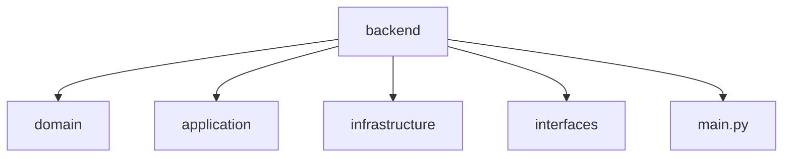

**Language:**  🇧🇷 Português | [🇺🇸 English](./README.md)

# Central de Chamados – Backend

### Backend Serverless Multi-Tenant para Estruturação de Atendimento via WhatsApp

---

## 1. Visão Geral

Este repositório contém o serviço principal de backend da plataforma **Central de Chamados**.

Ele é responsável por transformar interações desestruturadas, originadas no WhatsApp, em um fluxo operacional estruturado, rastreável e multi-tenant.

Este backend é:

- Orientado a domínio  
- Serverless  
- Multi-tenant  
- Projetado para produção  
- Preparado para evolução com camada de IA (AI-ready)  

Não se trata de um projeto de tutorial.

É um exercício real de arquitetura aplicado à resolução de ineficiências operacionais em pequenas operações de serviço.

---

## 2. Problema que Está Sendo Resolvido

Pequenas operações de serviço utilizam o WhatsApp para:

- Orçamentos  
- Aprovação de serviços  
- Atualizações de status  
- Reclamações  
- Pós-venda  

O WhatsApp resolve comunicação — não gestão.

Isso gera:

- Chamados esquecidos  
- Status implícitos  
- Histórico não estruturado  
- Dependência da memória do proprietário  
- Baixa capacidade de escala  

Este backend introduz:

> Estrutura formal sobre comunicação informal.

---

## 3. Modelo Arquitetural

### Características Principais

- SaaS  
- Multi-tenant  
- Serverless  
- API-first  
- Escalável horizontalmente  
- Estrutura orientada a domínio  

### Stack Principal

- AWS Lambda  
- API Gateway  
- DynamoDB (Single Table Design)  
- Autenticação baseada em JWT  
- Terraform (infraestrutura gerenciada separadamente)  

---

## 4. Modelagem de Domínio

O sistema é modelado com base em padrões reais de consulta, não apenas normalização teórica.

### Entidades Principais

- Empresa (Tenant)  
- Usuário  
- Cliente  
- Aparelho  
- Chamado  
- Histórico de Chamado  
- Configuração de Atendimento  

### Princípios de Design

- Histórico como entidade de primeira classe  
- Transições de status explícitas  
- Isolamento por `company_id`  
- Modelagem orientada a padrão de acesso  
- Operações críticas idempotentes  

---

## 5. Estratégia de Multi-Tenancy

Cada registro contém `company_id` como parte da estrutura de chave primária.

Estratégia de isolamento:

- Isolamento lógico no nível do banco  
- Contexto de autorização vinculado ao JWT  
- Queries sempre escopadas por tenant  
- Ausência de agregações entre empresas  

Permite escala horizontal sem duplicação de banco.

---

## 6. DynamoDB e Single Table Design

O sistema utiliza Single Table Design otimizado para:

- Performance previsível  
- Redução de operações semelhantes a joins  
- Recuperação eficiente de Chamado + Histórico  
- Modelagem baseada em padrão de acesso  

### Por que DynamoDB?

- Baixa latência  
- Escalabilidade horizontal nativa  
- Modelo pay-per-use  
- Simplicidade operacional em ambiente serverless  

### Trade-offs

- Maior complexidade de modelagem  
- Exige disciplina na definição de chaves  

---

## 7. Design da API

A API é:

- RESTful  
- Versionada  
- Stateless  
- Protegida por JWT  

### Princípios

- Idempotência em operações de escrita  
- Contratos de erro explícitos  
- Rotas conscientes de tenant  
- Separação clara entre domínio e camada de entrega  

---

## 8. Considerações de Produção

Projetado desde o início para produção:

- Escalabilidade automática  
- Estratégia de mitigação de cold start  
- Logs estruturados  
- Arquitetura preparada para métricas  
- Fronteiras explícitas de erro  
- Versionamento de API  
- Separação segura de ambientes  

---

## 9. Estratégia de Observabilidade (Planejada / Expansível)

- Logs estruturados em JSON  
- Correlation ID por requisição  
- Métricas por tenant  
- Classificação de erros  
- Monitoramento de latência  

Preparado para integração com stack de monitoramento.

---

## 10. Arquitetura Preparada para IA

A arquitetura permite integração futura de:

- Classificação automática de intenção  
- Sumário automático de histórico  
- Sugestão assistida de resposta  
- Detecção de risco de atraso  
- Análise de padrões operacionais  

O núcleo de domínio não exige reestruturação para suportar essas evoluções.

---

## 11. Estrutura do Projeto

## 13. Deploy

O deploy é gerenciado via Terraform no repositório dedicado de infraestrutura.

Este backend é empacotado e publicado na AWS Lambda dentro de uma arquitetura serverless.

Características do deploy:

- Infraestrutura como Código (Terraform)
- Separação de ambientes (dev / staging / prod)
- Versionamento de API via API Gateway
- IAM com princípio de menor privilégio
- DynamoDB provisionado via código
- Camada de execução stateless

O backend foi projetado para escalar automaticamente, operando em modelo de custo pay-per-use.

---

## 14. Decisões de Engenharia

### Por que Serverless?

- Escalabilidade horizontal automática  
- Redução de overhead operacional  
- Eficiência de custo (paga pelo uso)  
- Ciclo de iteração mais rápido  

Trade-off:
- Cold starts  
- Maior complexidade em observabilidade  

---

### Por que DynamoDB + Single Table Design?

- Modelagem orientada por padrão de consulta  
- Recuperação eficiente de hierarquias (Chamado + Histórico)  
- Escala horizontal nativa  
- Latência previsível  

Trade-off:
- Maior complexidade na modelagem inicial  
- Exige disciplina rigorosa na definição de chaves  

---

### Por que Multi-Tenant desde o início?

- Evita reescrita arquitetural no crescimento  
- Garante isolamento adequado entre empresas  
- Permite escalar como SaaS desde o MVP  

Trade-off:
- Restrições adicionais de autorização  
- Complexidade maior nas queries  

---

### Quando esta Arquitetura NÃO seria ideal?

- Workloads analíticos fortemente relacionais  
- Consultas complexas entre múltiplos tenants  
- Necessidade de transações fortes entre múltiplas entidades  

---

## 15. Status

Em desenvolvimento ativo.

Foco atual:

- Endurecimento das regras de domínio  
- Expansão da validação do ciclo de vida dos chamados  
- Evolução da observabilidade  
- Testes de carga e validação de performance  
- Preparação de pontos de extensão para camada de IA  

O projeto é desenvolvido com mentalidade de produção e evolução incremental.

---

## 16. Propósito deste Repositório

Este backend demonstra:

- Modelagem de domínio aplicada a problema real  
- Arquitetura orientada à produção  
- Design de sistema serverless  
- Estrutura SaaS multi-tenant  
- Desenvolvimento consciente de infraestrutura  
- Decisões técnicas baseadas em trade-offs  
- Preparação para integração com camada de inteligência (AI-ready)  

Representa engenharia backend além de CRUD básico, com foco em escalabilidade, isolamento, rastreabilidade e evolução contínua.
